# Four Strings: site-wide UX audit

Captured 12 September 2026 for a redesign plan, not a functional certification. Desktop in-app browser at 1280 × 720. Source: current local app. No microphone capture or paid API requests are part of this audit.

## 1. Play entry — recognisable, but task choice is misleading

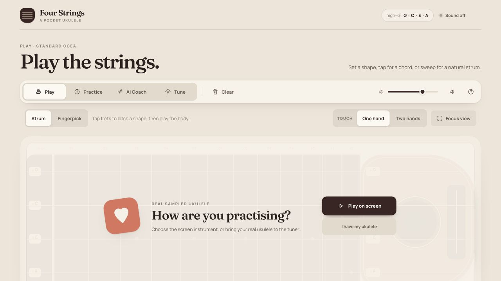

- Strength: distinctive warm instrument workbench, short purpose statement, four primary destinations and one/two-hand choice.
- Risk: “How are you practising?” is inside the Play instrument overlay. “I have my ukulele” explicitly sends the learner to the tuner, even though their intention could be songs or coaching. Instrument source and learning destination are different decisions.
- Risk: a tall title/navigation/control stack leaves the lower instrument outside the initial 720px viewport. The first action is visible but not the complete playing surface.
- Accessibility risk: small muted instructional labels and understated help icon need measured contrast and readability checks. Screenshot alone cannot establish contrast compliance.
- Recommendation: preserve instant screen play; give real-instrument users a destination-neutral source choice with optional Tune first, never a forced detour.

## 2. Fingerpick — capable, but the build mode needs explanation

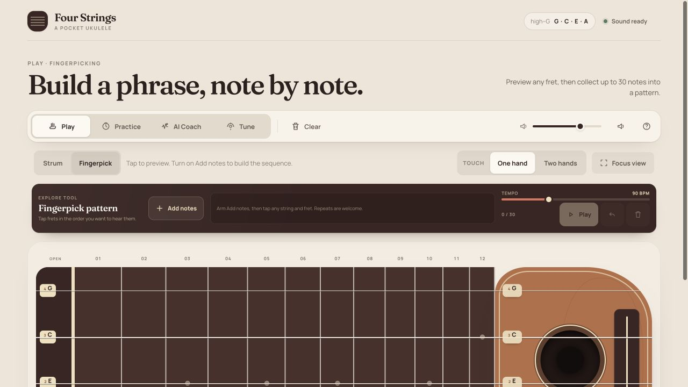

- Strength: separate preview/build behavior, a visible 30-note limit and tempo control; one/two-hand access is preserved.
- Risk: the visible “Tap frets in the order…” competes with “Arm Add notes…” while Play is disabled. A learner can tap and hear notes without understanding why the sequence stays empty.
- Risk: toolbar is dense and low-height; tiny instruction text and a second large page headline consume space better given to the instrument and phrase sequence.
- Recommendation: explicit “Just play / Build a pattern” choice, show a one-line example before the first note, then a numbered editable sequence with Play/Stop and BPM together. Do not automatically arm recording when entering the screen.

## 3. Practice entry — visible start, too much setup and inconsistent song trust

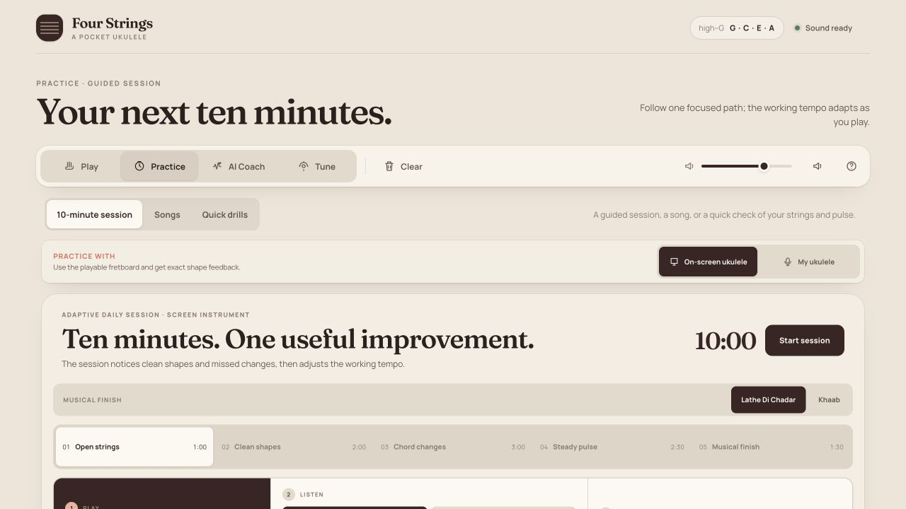

- Strength: session duration, Start session and three Practice destinations are visible; source is selectable before starting.
- Risk: two similar oversized titles repeat the promise. The instrument-source row and expanded future stages push actual guidance below the fold.
- Important trust inconsistency: the “Musical finish” selector still offers Lathe Di Chadar and Khaab without qualification. These names are marked unavailable in Songs. The audit has not played the final stage; the confirmed issue is the conflicting promise/availability in the visible UI, not a newly verified audio bug.
- Recommendation: compact session preview with duration, skill and source; one Start action. Use a shared playable-course policy in every entry point, or honestly label a generic finish as an original chord exercise.

## 4. Active session — target and controls are separated

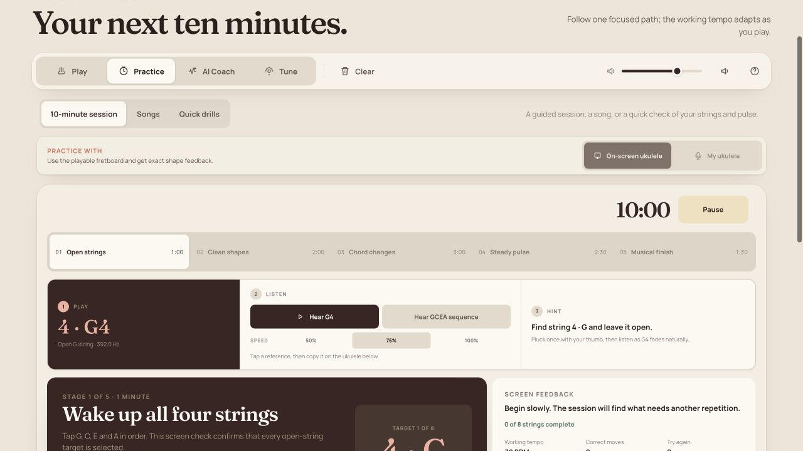

- Observed: Start changes to Pause; Pause changes to Resume and preserves place. Source controls are disabled while active and remain disabled when paused.
- Strength: Play/Listen/Hint grouping has useful content and distinct roles.
- Risk: the G target appears in the guidance band and again in a lower task card, with additional feedback alongside. The playable instrument is farther below, so the learner cannot see the target and play area together in the captured viewport.
- Risk: blocked source switching is not explained beside the disabled controls; users may not know that ending/resetting the session is required.
- Recommendation: one Now/Next task strip immediately beside the instrument or real-ukulele meter; session progress is secondary. Show “End session to switch instrument” or provide a deliberate pause-and-switch action with clear progress consequences.

## 5. Quick drills — the destination is right, the shell still feels like another product

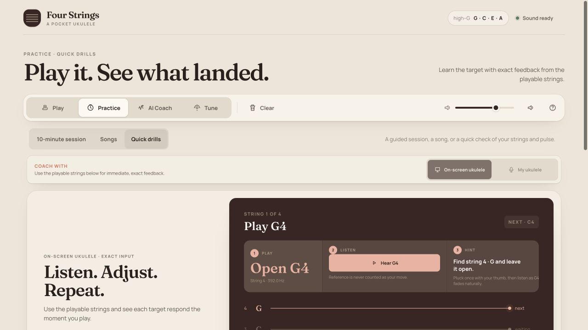

- Strength: normal Coach is correctly under Practice; string clarity and pulse are clearly different drills, with exact-input versus microphone descriptions.
- Risk: “Start coaching” inside Quick drills and “AI Coach” in the primary navigation create two meanings of coach. Rename the local action “Start drill.”
- Risk observed in this journey: after pausing the 10-minute session and opening Quick drills, both instrument-source buttons remain disabled although this drill has not started. The screen gives no explanation for the cross-destination lock.
- Risk: large introductory text competes with the live target and repeats material already in the page heading. Start is below the current viewport.
- Recommendation: share the focused practice shell, show selectable drill chips above it, keep the action and current target visible, and release or explain source locks on navigation.

## 6. Songs discovery — unavailable content is the default first impression

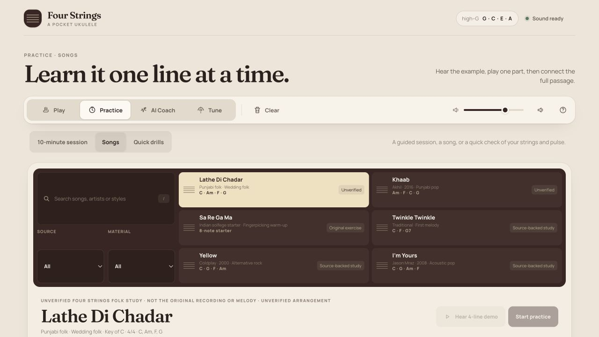

- Strength: local search, source/material filters and visible provenance are useful and honest.
- Important risk: the library opens on Lathe Di Chadar, an unavailable arrangement. It is the first highlighted tile, and the first lesson actions are disabled. The first two entries are both unavailable, ahead of usable beginner lessons.
- Risk: cards foreground artist/genre/chords/source status, but not the learner's concrete outcome (“play your first melody” versus “strum an accompaniment”). Sa Re Ga Ma is inside Songs but Material has no Exercise choice.
- Recommendation: call the area “Songs & lessons”, lead with playable starters, group unavailable material separately, and use outcome/technique as the primary filter. Keep source evidence expandable instead of making beginners classify provenance before learning.

## 7. Selected lesson — browsing occupies the teaching workspace

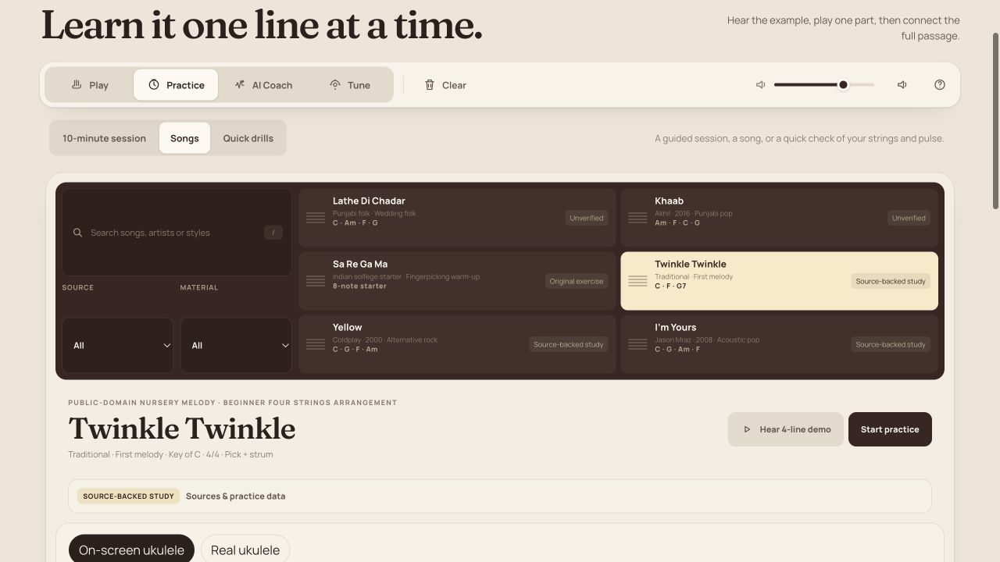

- Strength: Twinkle is explicitly a beginner arrangement with chapter-specific melody and strum options; source evidence remains available.
- Risk: the full catalog remains above every lesson, while chapter choice and the teaching cue are farther down. The overview shows Start practice before the selected chapter's outcome is easy to inspect.
- Risk: three audio scopes (whole demo, phrase, single note) plus record/save/replay are spread across multiple bands. “Real ukulele” differs from “My ukulele” elsewhere.
- Recommendation: separate browse → lesson overview → focused player states within Practice. Put chapter outcomes and “What you will hear” (melody/accompaniment) before Start; keep catalog behind Back to lessons. Put reference scopes in one transport and record controls in an optional take drawer.

## 8. AI Coach entry — compelling capability, primary action out of view

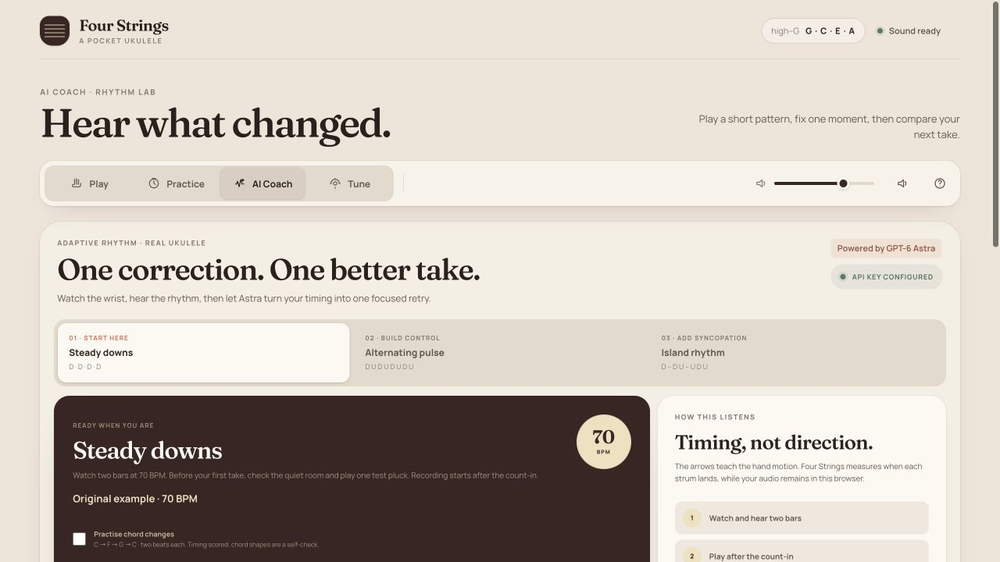

- Strength: concrete promise, progressive rhythms, explicit timing-only boundary, model attribution and key readiness.
- Risk: page title, second headline, pattern row, large illustration and explanation sidebar precede the initial controls. At 1280 × 720 the learner cannot yet see Watch & hear or Start first take.
- Risk: “API key configured” and “Mic off” describe different readiness states; configured is not evidence that the provider or microphone will work. Keep technical configuration secondary and show a clear next action.
- Recommendation: a compact stage rail (Listen → Check mic → Play → Feedback → Retry → Compare), one main action, and a single focused rhythm scene. Explain limitations in a short expandable note. Do not remove explicit microphone consent or the no-audio-upload boundary.

## 9. AI demonstration — strong teaching visual, weak transport/state hierarchy

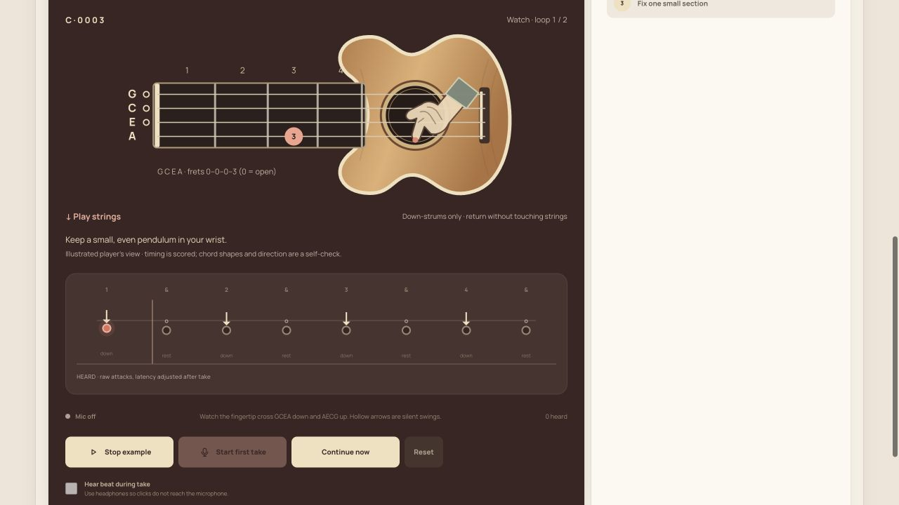

- Observed: Watch & hear starts the local two-bar example and changes to Stop example; the down-strum timeline and hand animate. No microphone or provider request was initiated.
- Strength: the instrument, fret diagram and current timing marker make the demonstration tangible.
- Important risk: “Continue now” is visible alongside Stop example during the demonstration. It competes with the meaningful action despite the controller intending that shortcut for preparation/retry waits. A redesign must explicitly test phase-specific visibility, not merely button wiring.
- Risk: the main BPM is above the scrolled viewport while the transport is near the bottom. The explanatory sidebar stretches as an almost empty column. Copy below the lane mentions upstrokes/hollow arrows although this is the beginner down-only pattern.
- Recommendation: one compact performance scene with current BPM, loop count, direction and Stop together; render state-appropriate actions and pattern-specific instructions. Move explanation into a compact drawer when it has useful content.

## 10. Tune desktop — coherent task, still too much introduction

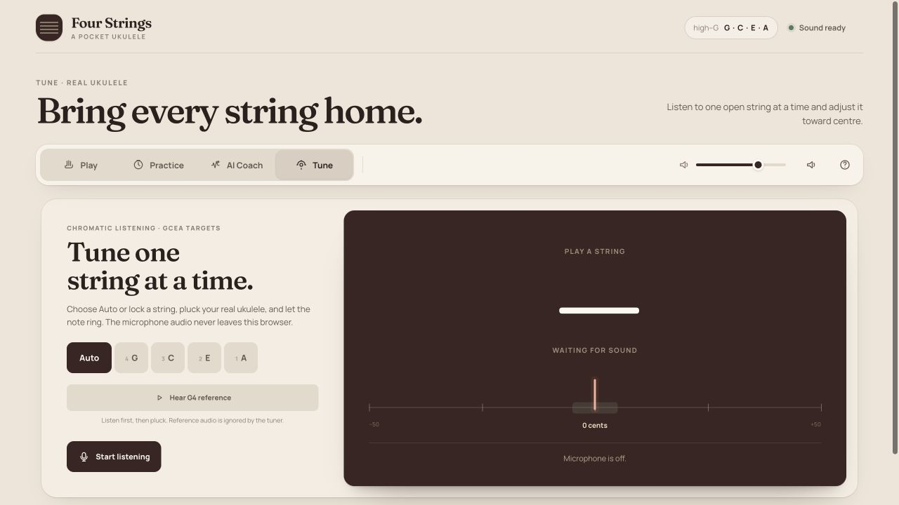

- Strength: clear Auto/GCEA targets, reference note, explicit Start listening and visible microphone-off state; the pitch meter has a stable visual centre.
- Risk: two headings repeat the task; large empty waiting meter and introduction have equal weight. “0 cents” is visible before a reading, which could be mistaken for a tuning result unless paired with the waiting state.
- Recommendation: make chosen string / heard note / adjustment the focal group. Before permission, show “Microphone off — Start listening”; before a valid pitch, use an unset value instead of a result-like zero. Offer an explicit return to the lesson the learner came from.
- Limit: no microphone was activated, so tracking, tuning accuracy and lock persistence were not assessed in this audit.

## 11. Tune phone — usable action, feedback competes with bottom navigation

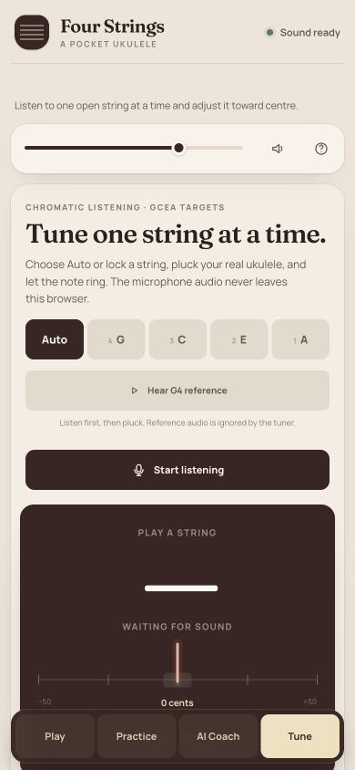

- Strength: controls reflow and Start listening remains a large obvious button; persistent bottom navigation is readable.
- Risk: the volume/help row consumes prime vertical space even when the microphone is the main task. Meter/status extend behind or below the fixed navigation; primary feedback should sit above that boundary.
- Recommendation: compact utility menu, reserve a measured bottom-navigation inset and ensure focused controls plus last pitch/adjustment remain visible.

## 12. AI Coach phone — the first action needs multiple screens of reading

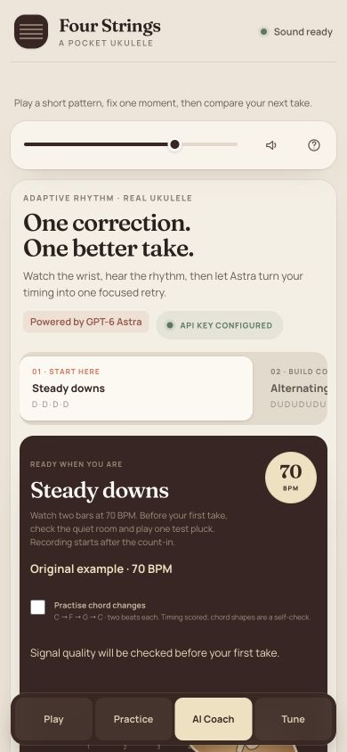

- Strength: warm hierarchy and large pattern cards remain recognisable; bottom navigation preserves destination access.
- Risk: initial viewport contains branding, utility bar, headline, explanation, badges, pattern choice and more instructions—but no Start/Listen action or full teaching instrument. Later pattern options are clipped horizontally without a strong browsing cue.
- Recommendation: mobile order should be stage/title → current musical target → one next action → optional details. Keep a compact pattern picker; reserve a sticky transport above navigation instead of stacking every panel.

## 13. Play phone — responsive controls, insufficient room to play

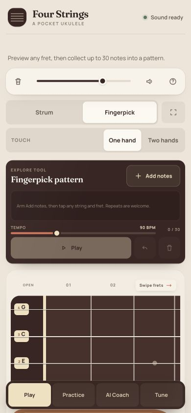

- Strength: Strum/Fingerpick and One hand/Two hands are explicit; the neck advertises horizontal scrolling.
- Risk: header, utility bar, two mode rows and expanded empty pattern builder occupy roughly the first 540px. Only part of the neck is visible, and the strum deck is below it. The initial view showcases configuration more than playing.
- Recommendation: preserve both hand layouts; make the phrase builder compact until armed/filled, put only mode and essential transport near the instrument, and make the play surface the focal region. Do not shrink fret targets to fit all twelve on a phone.

## Priority and evidence limits

1. **P0: trustworthy state and availability.** Resolve the cross-view source lock, contradictory unverified-song entry points, and phase-inappropriate Continue control before applying visual polish.
2. **P1: shared focused workspace.** Unify source choice, current target, transport, feedback and secondary details; keep the instrument/meter with the action.
3. **P1: lesson discovery and outcomes.** Usable starters first, separate library/overview/player, distinguish melody/accompaniment/exercise.
4. **P2: coherent visual scale and accessibility verification.** Compact repeated headers, strengthen small text, test focus/safe areas/reduced motion and real devices.

This is an expert inspection of captured entry/demo/paused states—not a usability study or complete functional regression. No physical microphone, live Astra correction, comparison, saved-take flow or complete song performance was exercised. Proposed changes to those later phases use current controller/source inspection and require fresh captured-state validation in implementation. Screenshots do not establish WCAG compliance. The browser viewport was reset after the phone captures. Existing user data, app source and API configuration were not modified.

## Research informing the proposal

- [NN/g: Progressive Disclosure](https://www.nngroup.com/articles/progressive-disclosure/) supports keeping advanced/less-used controls behind a clear secondary reveal; this does not justify hiding the current task or recovery controls.
- [W3C: Target Size (Minimum)](https://www.w3.org/WAI/WCAG22/Understanding/target-size-minimum) specifies a 24 CSS pixel AA minimum with exceptions. This product should choose 44 × 44 CSS pixels for primary touch actions as a stronger usability target, not misstate the AA minimum.
- [W3C: Focus Not Obscured](https://www.w3.org/WAI/WCAG22/Understanding/focus-not-obscured-minimum) is relevant to persistent bottom navigation and the proposed transport; keyboard focus must not be hidden by them.
